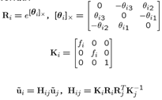

# Panorama Image Stitching

16340028 陈思航

## 题目

Submit your source code and your report.

- Take pictures on a tripod (or handheld)
- Warp images to spherical coordinates
- Extract SIFT features and Match features(by
  KNN or Hashing)
- Align neighboring pairs using RANSAC
- Write out list of neighboring translations
- Correct for drift
- Read in warped images and blend them (using
  multi-scale blending or Poisson blending)
- Crop the result and import into a viewer

## 题目的实现

### Spherical / Cylindrical projection

​	多张图片在拍摄时镜头朝向是不同的，重合部分图像中的物体并不完全符合视觉一致性的要求。通过将图像进行投影，可以使得图像中的物体符合视觉一致性要求。环形的全景图像中，由于柱面投影比较普遍且简单，而且投影后重合部分的图像为符合视觉一致性要求的圆弧。故通过柱面投影可以获得符合要求的图像，为后面的图像拼接做准备。如下图，其图像重合区域不满足视觉一致性要求，故通过柱面投影可以将其转换为符合一致性视觉要求的图像。


​	在柱面投影中，把观测点定位于圆柱中央。同时，图像的像素焦距与摄像头到圆心距离的和为柱体的半径，此时摄像头拍摄的图像与柱体相切。由于`CImg`中以左上角作为原坐标点，故换算公式为：
$$
x=\frac{x' - \frac{W}{2}}{k} + \frac{W}{2} = \frac{(x' - \frac{W}{2})\sqrt{R^2+(x-\frac{W}{2})^2}}{R} + \frac{W}{2}\\
y=\frac{y' - \frac{H}{2}}{k} + \frac{H}{2} = \frac{(y' - \frac{H}{2})\sqrt{R^2+(y-\frac{H}{2})^2}}{R} + \frac{H}{2}
$$
在这之后，可以通过双线性插值对在柱面投影图像上没有被映射到的点进行计算。

#### 双线性插值

在柱面投影中，无法保证柱面投影图像上的点都被一一映射到，即X’的值不可能恰好就是原图像像素点的位置，因此通过双线性插值实现帧图像像素点的值进行补全。双线性插值的核心思想是在两个方向分别进行一次线性插值。

即对于S(x, y)，有
$$
S(x, y) = (1-a) ×(1-b)×S(i, j) + a ×(1-b)×（i+1，j）+\\ (1-a)×b×S(i,j+1) + a×b×S(i+1, j+1)
$$


### SIFT

​	局部特征点的提取的计算可以说是图像拼接最核心的一步之一。之前自己参照已有的基于`openCV`的代码和算法介绍从头到尾5个步骤实现了一次。但是自己实现的SIFT算法极慢，特别是关键点描述子的生成特别慢，一秒钟才算完一个关键点。这是因为一共有300+个特征点，每个特征点有128个描述子，不对算法进行优化会造成效率极低的情况。即使通过多线程优化但效果不佳。后来老师允许使用`VLFeat`情况才有所改观。在本文的最后，会贴上自己实现的`CImg`版本的SIFT算法以供参考。

​	SIFT特征对图像旋转、尺度缩放、亮度变化保持不变形，而且稳定性很好，无论是视角变化、仿射变换等都有很好的稳定性。其次，它的独特性好，信息量丰富，而且多量，具有可扩展性。总的来说，SIFT特征可以作为一张图像主要信息量的代表，对于两张图像相近SIFT点的提取即可通过图像变换对其进行拼接。

#### 尺度空间生成

尺度空间的目的是模拟图像数据的多尺度的特征。通过高斯卷积可以对尺度空间进行表示。二维尺度空间可以定义为：
$$
L(x, y, \sigma) = G(x,y,\sigma) *I(x,y)
$$
其中
$$
G(x,y,\sigma) = \frac{1}{2\pi \sigma ^2}e^\frac{-(x^2+y^2)}{2\sigma^2}
$$
为可变的高斯函数。`simga`为尺度坐标。经过4次图像平滑和降采样，构建高斯金字塔。为了让尺度体现连续性，在简单采样的基础上通过高斯滤波生成几组图像。而在进行平滑前后的残差，通过引入新的算子DOG计算响铃尺度高斯平滑后图像的差，建立DOG（高斯差分）金字塔，提取图像高频特征。

#### 尺度空间极值

关键点由DOG空间局部极值点组成。为寻找DOG的极值点，需要将每一个像素点要和它所有的相邻点比较，看其是否比它的图像域和尺度域的相邻点大或者小。一共需要比较共3个层26个对应的领域点。在极值比较的过程
中，每一组图像的首末两层是无法进行极值比较的为了满足尺度变化的连续性，我们在每一组图像的顶层继续用高斯模糊生成了3幅图像，高斯金字塔有每组S+3层图像。DOG金字塔每组有S+2层图像。


#### 定位极值点

##### 定位极值点

​	这里通过拟合三维二次函数的方式确定关键点的位置和尺度，同时对不稳定的边缘相应点和关键点进行舍弃，提高图像的稳定性。

将空间尺度函数进行泰勒展开，有
$$
D(x,y\sigma)=D(x,y,\sigma)+\frac{dD^t}{dx}x+\frac{1}{2}x^T\frac{d^2D}{dx^2}x
$$
进行求导，令其为0，得到精确位置的x
$$
\widehat{x} = -\frac{d^2D^{-1}}{dx^2}\frac{dD}{dx}
$$
将其代入上面的式子有
$$
D(\widehat{x}) = D(x,y,\sigma)+\frac{1}{2}\frac{dD^T}{dx}\widehat{x}
$$


将已经检测的特征点，保留满足如下条件的点
$$
|D（\widehat{x})|=D(x,y,\sigma)\geq 0.03
$$
即可。但是，仅仅定位极值点是不够的，还应该再排除边缘的相应。

##### 排除边缘相应

如果定义不好的高斯差分算子的极值再横跨边缘的地方有较大的主曲率。主曲率通过2×2的Hessian矩阵求出。
$$
\begin{bmatrix}

     D_{xx} & D_{xy} \\

     D_{xy} & D_{yy}

\end{bmatrix}
$$
通过如下计算：
$$
Tr(H)= D_{xx} + D_{yy}\\
Det(H) = D_{xx}D_{yy} - (D_{xy})^2
$$
选取满足如下条件的点：
$$
\frac{Tr(H)^2}{Det(H)} < \frac{(r+1)^2}{r}
$$
r取10。

#### 为关键点指定方向参数

​	通过极值点的梯度给每个关键点指定128维度的方向参数。
$$
m(x,y) = \sqrt{(L(x+1,y) - L(x-1,y))^2+(L(x,y+1) - L(x,y-1))^2}\\
\theta(x,y) = atan2((L(x,y+1) - L(x,y-1))/L(x+1,y) - L(x-1,y))
$$
其中上下式为(x,y)处梯度的模和方向公式。L采用的尺度为每个关键点各自所在尺度。

至此，每个关键点由位置、所处尺度和方向信息、

#### 关键点分配

在这一步，通过梯度值放图统计法，以关键点为原点，dui 一定区域内像素点对关键方向生成所做的贡献进行统计。

- 直方图以每10度方向为一个柱，共36个柱，柱所代表的方向为像素点梯度方向，柱的长短代表了梯度幅值。
- 根据Lowe的建议，直方图统计半径采用3*1.5*σ。
- 在直方图统计时，每相邻三个像素点采用高斯加权，根据Lowe的建议，模板采用[0.25,0.5,0.25]，并连续加权两次。

分配步骤如下：

- 确定计算关键点直方图的高斯函数权重函数参数 ；
- 生成含有36柱的方向直方图，梯度直方图范围0~360度，其中每10度一个柱。由半径为图像区域生成；
- 对方向直方图进行两次平滑使用高斯函数对直方图进行平滑，减少突变的影响；
- 求取关键点方向（可能是多个方向）；
- 对方向直方图的Taylor展开式进行二次曲线拟合，精确关键点方向；

至此，关键点已经检测完毕。

#### 描述子生成

描述子应该具有2×2×8维向量表征。然后在4×4的窗口内计算8个方向的梯度方向直方图。绘制每个梯度方向的累
加可形成一个种子点，如右图所示：一个特征点由4个种子点的信息所组成。共有4×4×8维向量表征。每个直方图有8方向的梯度方向，每一个描述符包含一个位于关键点附近的四个直方图数组。这就导致了SIFT的特征向量有128维。


在进行生成的时候，需要对描述子梯度方向直方图进行绘制，它是由关键点所在尺度模糊图像计算产生（d = 4）
$$
radius=\frac{3\sigma_{0ct}×\sqrt{2}×(d+1)+1}{2}
$$
为了保证特征矢量具有旋转不变性，需要以特征点为中心，将特征点附近邻域内图像梯度的位置和方向旋转一个方向角θ，旋转后坐标为:
$$
\begin{pmatrix}

     \widehat{x} \\

     \widehat{x}

\end{pmatrix}
=
\begin{pmatrix}

     cos(\theta) & -sin(\theta) \\

     sin(\theta) & cos(\theta)

\end{pmatrix}
×
\begin{pmatrix}

     x \\

     y

\end{pmatrix}
$$
在求出梯度幅值和方向的时候，按照如下步骤：


之后在2×2大小窗口的区域内计算8个方向的梯度方向直方图，之后绘制每个梯度方向的累加值。可以形成种子店，在下一个2×2区域内进行直方图统计，形成下一个种子点，共生成16个。

在进行描述子向量元素门限化以及门限化后的描述子向量规范化，将方向直方图每个方向上幅值限制在门限下（0.2）。

至此，关键点描述子生成。

### 图像拼接

在进行图像拼接的时候，从中间的图像开始，按照左右交替的顺序从中间到两边进行拼接，避免长图像的变形。在拼接前，将图像按照顺序进行序号排序，以减少计算的步骤以及增加图像拼接的准确度。

在进行两张图像拼接的时候，需要获得SIFT特征点的pair。这里使用KD Tree对特征点的pair进行查找。

#### KD Tree

首先需要进行建树。KD树在根节点以某一维度对点集进行分割，比如以x为序将点集分割，找到x为序的中点，将它作为根节点，比它小的作为左子树，比它大的作为右子树，递归建树。在实验中，对A图像的所有特征点的128维度描述子进行进行建立树操作。树有两个维度，一个维度是特征点，另一个维度是描述子。在这之后，遍历B图中的所有特征点，如果该特征点的所有描述子与A图某一点的所有特征子的L2范式距离最小，则该特征点与A图特征点匹配。在实际过程中，需要找出两个和A图特征点最临近的点，并判断它们的距离。如果距离过小则需要进行舍弃，避免重复算出同个类似的特征点。

#### RANSAC

在随机抽样一致之前，需要对从A图到B图和从B图到A图的pair进行判断，如果A图到B图的特征点pair数量多，则清空另一边的所有特征点，将A图到B图的特征点pair反向赋值该从B图到A图的特征点pair，以获得更多的pair。

RANSAC的步骤如下：

- 随机选取四对pairs
- 之后利用这四对pairs解出方程A(x) =b，获得Homography矩阵H。
- 利用矩阵H计算inliers的数量满足

$$
SSD(p_i', H_{p_i}) < \epsilon
$$

- 选择数量最多inliners对应的矩阵H，并重复步骤一，次数为

$$
k = \frac{log(1-P)}{log(1-P^n)}
$$


​	以保证H矩阵准确性。

- 对于所有的inliners，重新通过最小二乘法计算Homography矩阵H。

##### DLT求解Homography矩阵H

$$
\begin{bmatrix}

     H_{11} & H_{12} & H_{13} \\

     H_{21} & H_{22} & H_{23} \\
     H_{31} & H_{32} & 1 \\

\end{bmatrix}
$$


Homography矩阵H是一个3×3的矩阵，用于拟合两个图像间特征匹配的关系。
$$
x'=Hx => x'×Hx =0\\
\begin{pmatrix}

     u \\

     v\\
     1

\end{pmatrix}
=
H
\begin{pmatrix}

     x \\

     y\\
     1

\end{pmatrix}
$$


在矩阵H中，除了最后一个元素为1，其他元素都是未知的，所以一共有8个未知的参数，需要四组特征点进行计算。在RANSAC第五步解出H的时候，只能通过最小二乘法进行拟合，因为inliners的数量大于4。

#### 图像的旋转变换

利用H矩阵，可以将待拼接的图像旋转变换到新图像上，而对于另一张图像，只需要进行平移即可。在新的图像上，这两两张图像就叠加在一起了。




与投影类似，因为无法保证新的图像上的所有的点都被一一映射到，所以需要通过双线性插值对没有被旋转图像映射到的点通过邻域进行像素值计算。

#### 图片边界判断

因为这次图像拼接只考虑左右的图片拼接，所以不考虑垂直的情况，所以在进行新图像的大小计算的时候，需要计算从待拼接图像通过H矩阵映射后的最小的值，以次作为边界，避免溢出。对于高度也是类似。因为不考虑旋转，所以只需要将新图像的高度和宽度分别对应原本图像height和width进行边界判断即可。

#### 更新特征点的位置信息

这里因为图像已经经过变换，所以只需要通过新图像的最小和w和h作为偏移量进行计算即可。

#### 泊松融合

在进行图像拼接的过程中，很容易出现左右图像中间重叠部分不自然的情况。

在泊松融合中，我们需要处理函数


如果要把图像A融合在图像B上，那么f表示融合的结果图像C，f*表示目标图像B，v表示源图像A的梯度，▽f表示f的一阶梯度，Ω表示要融合的区域(ROI)。dΩ代表融合区域的边缘部分。

可以这么说，在目标图像B边缘不变的情况下，得在融合部分的梯度与源图像A在融合部分的梯度最为接近的融合部分的图像C。

泊松融合首先通过计算重叠区域作为ROI（因为图像只进行水平拼接，所以不考虑垂直的情况）。在此之后通过将AB图像进行高斯卷积和降采样（与SIFT类似）建立高斯金字塔，再通过两层高斯金字塔建立拉普拉斯金字塔（还是与SIFT类似）。之后建立结果图像的金字塔，从塔底到塔顶将将图像A的拉普拉斯金字塔的左半部分节点复制到结果图像拉普拉斯金字塔的相应节点，以及将图像B拉普拉斯金字塔的右半部分节点复制到结果图像的右半部分节点来构造的。通过上采样恢复从而得到结果图像。

#### 直方图均衡化的权衡

为了解决新图像每一部分的亮度不均匀的文图，我很独创性想到用自己之前直方图均衡的方法解决。但是直方图均衡化后亮度增加极大，所以想到通过赋予一定的权重（加权和）利用YCbCr格式图像来调节画面的亮度。但是发现一个问题，就是如果均衡化后图像的权重过大则画面过亮，特别熟拼接图像数量较大的时候；但权重过小则拼接图片较小的时候效果没有体现出来，故删除这一部分。与其他同学交流后，他们也沿用这种方法，但是效果似乎都很一般。对于我自己，因为时间问题，关于亮度不均匀的问题只能搁置。


### 代码实现过程

#### SIFT特征提取

这里有两种实现方式，一种是自己实现的，放在本文的末尾，另一种是调用`vlfeat`的，过程类似知识调用api的SIFT特征提取的过程较为简洁，但是需要注意将`CImg`类型的图像转换位`float*`。

```C++
// sift特征提取
//https://www.cnblogs.com/wangguchangqing/p/9176103.html
map<vector<float>, VlSiftKeypoint> ImageProcess::siftAlgorithm(const CImg<unsigned char> &projectedSrc)
{

	// 新建vlFeat的图像
	vl_sift_pix *vlImg = new vl_sift_pix[projectedSrc.width() * projectedSrc.height()];

	cimg_forXY(projectedSrc, x, y)
	{
		vlImg[y * projectedSrc.width() + x] = (float)projectedSrc(x, y, 0);
	}

	// 金字塔层数 每层中的图像
	int noctaves = NOTAVES_NUM, nlevels = LEVEL_NUM;
	VlSiftFilt *siftFilt = vl_sift_new(projectedSrc.width(), projectedSrc.height(), noctaves, nlevels, 0);

	map<vector<float>, VlSiftKeypoint> features;

	// 计算DOG
	if (vl_sift_process_first_octave(siftFilt, vlImg) != VL_ERR_EOF)
	{
		while (true)
		{
			// 查找关键点
			vl_sift_detect(siftFilt);
			VlSiftKeypoint *pKeypoint = siftFilt->keys;
			// 对于每个关键点进行描述子构造
			for (int i = 0; i < siftFilt->nkeys; i++, pKeypoint++)
			{
				VlSiftKeypoint vlKeypoint = *pKeypoint;

				// 四个角度
				double angles[4];
				int angleCount = vl_sift_calc_keypoint_orientations(siftFilt, angles, &vlKeypoint);
				for (int j = 0; j < angleCount; j++)
				{
					double tempAngle = angles[j];
					// 初始化描述子
					vl_sift_pix descriptors[DESCRIPTOR_SUM];

					// 获得每个关键点的描述子
					vl_sift_calc_keypoint_descriptor(siftFilt, descriptors, &vlKeypoint, tempAngle);

					vector<float> descriptorVec;
					for (int j = 0; j < DESCRIPTOR_SUM; j++)
					{
						descriptorVec.push_back(descriptors[j]);
					}
					vlKeypoint.ix = vlKeypoint.x;
					vlKeypoint.iy = vlKeypoint.y;
					features.insert(pair<vector<float>, VlSiftKeypoint>(descriptorVec, vlKeypoint));
				}
			}
			if (vl_sift_process_next_octave(siftFilt) == VL_ERR_EOF)
			{
				break;
			}
		}
	}
	// 销毁指针
	vl_sift_delete(siftFilt);
	delete[] vlImg;
	vlImg = NULL;
	return features;
}
```

#### 特征对获取

这里使用KD Tree对前后两张图像的特征点对进行获取，过程在上面详细叙述过了。

```C++
vector<ImgPair> ImageProcess::getImgPair(Image &imgA, Image &imgB)
{
	// 这里使用KD树节省查找时间
	// dataType	type of data (VL_TYPE_FLOAT or VL_TYPE_DOUBLE)
	// dimension	data dimensionality.
	// numTrees	number of trees in the forest.
	// distance	type of distance norm (VlDistanceL1 or VlDistanceL2). 这里选择L1范数，但是我在另外一篇使用的是L2范数

	VlKDForest *forest = vl_kdforest_new(VL_TYPE_FLOAT, DESCRIPTOR_SUM, 1, VlDistanceL1);

	// 共有128 * number of keypoints 的特征点
	float *imgA_Descriptors = new float[imgA.features.size() * DESCRIPTOR_SUM];

	// 将其放入到数组中
	auto it = imgA.features.begin();
	for (int i = 0; it != imgA.features.end(); it++, i++)
	{
		const vector<float> &descriptors = it->first;
		for (int j = 0; j < DESCRIPTOR_SUM; j++)
		{
			imgA_Descriptors[i * DESCRIPTOR_SUM + j] = descriptors[j];
		}
	}

	// numData	number of data points.
	// data	pointer to the data.
	// The function builds the KDTree by processing the data data.
	// For efficiency, KDTree does not make a copy the data, but retains a pointer to it.
	// Therefore the data buffer must be valid and unchanged for the lifespan of the object.
	// The number of data points numData must not be smaller than one.
	// 建立KD树
	vl_kdforest_build(forest, imgA.features.size(), imgA_Descriptors);

	vector<ImgPair> res;

	// 利用KD树对特征点进行寻找
	VlKDForestSearcher *searcher = vl_kdforest_new_searcher(forest);
	// VlKDForestNeighbor : Neighbor of a query point.
	VlKDForestNeighbor neighbours[2];

	// 图像B的特征点数据
	for (auto it = imgB.features.begin(); it != imgB.features.end(); it++)
	{
		float temp_data[DESCRIPTOR_SUM];

		for (int i = 0; i < DESCRIPTOR_SUM; i++)
		{
			temp_data[i] = (it->first)[i];
		}

		// neighbors	list of nearest neighbors found (output).
		// numNeighbors	number of nearest neighbors to find.
		// query	query point.
		// Returns
		// number of tree leaves visited.
		// A neighbor is represented by an instance of the structure VlKDForestNeighbor.
		// Each entry contains the index of the neighbor (this is an index into the KDTree data)
		// and its distance to the query point. Neighbors are sorted by increasing distance.

		vl_kdforestsearcher_query(searcher, neighbours, 2, temp_data);

		float ratio = neighbours[0].distance / neighbours[1].distance;
		// 寻找到的两个点的距离比较远
		if (ratio < RATIO_THRESHOLD)
		{
			// 对应点上的描述子集合
			vector<float> dstDesciptors(DESCRIPTOR_SUM);
			// 利用A图像的DESCRIPTOR_SUM个描述子来反过来求出A的坐标
			for (int j = 0; j < DESCRIPTOR_SUM; j++)
			{
				dstDesciptors[j] = imgA_Descriptors[neighbours[0].index * DESCRIPTOR_SUM + j];
			}
			VlSiftKeypoint left = imgA.features.find(dstDesciptors)->second;
			VlSiftKeypoint right = it->second;
			// 获得匹配的对
			res.push_back(ImgPair(left, right));
		}
	}

	vl_kdforestsearcher_delete(searcher);
	vl_kdforest_delete(forest);

	delete[] imgA_Descriptors;
	imgA_Descriptors = NULL;
	return res;
}
```

#### RANSAC

在这一步，随机数的种子选择时间，好处是更加符合RANSAC算法的要求，坏处是效果可能并不是很稳定，随着时间不同结果图像有些许差别。这里通过公式计算循环次数k，之后进行步骤1-4的反复操作，求出最佳的Homography矩阵H。

```C++
srand(clock());
	int k = ceil(log(1 - 0.99) / log(1 - pow(0.5, NUM_OF_PAIR)));

	//最大投票值
	vector<int> maxInlinerInex;

	while (k--)
	{
		// 随机选取
		vector<ImgPair> randomPairs;
		set<int> randomIndex;

		// 初始化
		for (int i = 0; i < NUM_OF_PAIR; i++)
		{
			// 随机选择
			int index = rand() % (pairs.size());
			// 在已经选择的序号中不能出现
			while (randomIndex.find(index) != randomIndex.end())
			{
				index = rand() % (pairs.size());
			}
			randomIndex.insert(index);
			randomPairs.push_back(pairs[index]);
		}
		//		Homography应用：图像对齐，单应性矩阵
		//		上面公式得出的H ，对于图一中的所有点都是正确的，换句话说，可以用H将第一个图中的点映射到第二张图。
		//
		//		如何得到一个Homography
		//		要得到两张图片的H,就必须至少知道4个相同对应位置的点，opencv中可以利用findHomography正确得到
		Homography H = getHomographyMat(randomPairs);

		vector<int> inlinerIndex = getInlinerIndex(pairs, H, randomIndex);
		if (inlinerIndex.size() > maxInlinerInex.size())
		{
			maxInlinerInex = inlinerIndex;
		}
	}
	// 求出最大数量的inlier对应的Homography矩阵
	Homography t = getInlinerHomography(pairs, maxInlinerInex);

	return t;
```

在求解方程A(x) = b的时候，可以调用`CImg`的api。

```C++
Homography ImageProcess::getHomographyMat(const vector<ImgPair> &pair)
{

	// 求解AH = b
	CImg<double> A(4, NUM_OF_PAIR, 1, 1, 0);
	CImg<double> b(1, NUM_OF_PAIR, 1, 1, 0);

	for (int i = 0; i < NUM_OF_PAIR; i++)
	{
		A(0, i) = (double)pair[i].src.x;
		A(1, i) = (double)pair[i].src.y;
		A(2, i) = (double)pair[i].src.x * pair[i].src.y;
		A(3, i) = (double)1;
		b(0, i) = (double)pair[i].dst.x;
	}

	CImg<double> x1 = b.get_solve(A);

	for (int i = 0; i < NUM_OF_PAIR; i++)
	{
		b(0, i) = (double)pair[i].dst.y;
	}

	CImg<double> x2 = b.get_solve(A);

	return Homography(x1(0, 0), x1(0, 1), x1(0, 2), x1(0, 3), x2(0, 0), x2(0, 1), x2(0, 2), x2(0, 3));
}
```

#### 图像变换

首先需要计算新图像的边界点，这里的min值可以直接通过一次判断得出，但是Max值还是需要多次进行判断。

```C++
/ 获得新图像大小
			float min_x = (getXAfterWarping(0, imgs[dstIndex].projectedSrc.height() - 1, forward_H) < getXAfterWarping(0, 0, forward_H)) ? 
				getXAfterWarping(0, imgs[dstIndex].projectedSrc.height() - 1, forward_H) : getXAfterWarping(0, 0, forward_H);
			
			min_x = (min_x < 0) ? min_x : 0;
			float min_y = (getYAfterWarping(imgs[dstIndex].projectedSrc.width() - 1, 0, forward_H) < getYAfterWarping(0, 0, forward_H)) ?
				getYAfterWarping(imgs[dstIndex].projectedSrc.width() - 1, 0, forward_H) : getYAfterWarping(0, 0, forward_H);
			
			min_y = (min_y < 0) ? min_y : 0;

			float max_x = getMaxXAfterWarping(imgs[dstIndex].projectedSrc, forward_H);
			max_x = (max_x >= result.width()) ? max_x : result.width();
			float max_y = getMaxYAfterWarping(imgs[dstIndex].projectedSrc, forward_H);
			max_y = (max_y >= result.height()) ? max_y : result.height();

			int new_width = ceil(max_x - min_x);
			int new_height = ceil(max_y - min_y);

			CImg<unsigned char> a(new_width, new_height, 1, 3, 0);
			CImg<unsigned char> b(new_width, new_height, 1, 3, 0);
```

对于其中的一幅图像，需要通过H矩阵继续旋转从而实现图像的拼接，而对于另外一张不进行旋转的图像，只需要通过minX和minY作为偏移量将图像从原来的位置平移到新图像的位置上即可。与柱面投影类似，需要通过双线性插值进行部分像素点值的计算。

#### 泊松融合

因为之前对图片进行手动旋转和排序，所以在这一步，只需要对A和B图像的二分之一高位置的像素进行遍历，以选取重叠的区域。通过该ROI区域，可以通过重叠率判断像素点是否存在重叠区域中。之后通过高斯平滑和降采样建立高斯金字塔和拉普拉斯金字塔。通过从塔底到塔顶的融合生成新的图像并输出。

```C++
// 求出分组
	double count_ax = 0;
	// a图中不为0的点
	int a_notZero = 0;

	// 重叠区域XY的数量
	double count_overlapX = 0;
	int overlap_n = 0;

	for (int x = 0; x < a.width(); x++)
	{
		if (a(x, a.height() / 2, 0) != 0 && a(x, a.height() / 2, 1) != 0 && a(x, a.height() / 2, 2) != 0)
		{
			count_ax += x;
			a_notZero++;
			if (b(x, a.height() / 2, 0) != 0 && b(x, a.height() / 2, 1) != 0 && b(x, a.height() / 2, 2) != 0)
			{
				count_overlapX += x;
				overlap_n++;
			}
		}
	}

	// 最小长度
	int min = (a.width() < a.height()) ? a.width() : a.height();

	// 金字塔层数
	int levelNum = floor(log2(min));

	vector<CImg<float>> a_pyramid(levelNum);
	vector<CImg<float>> b_pyramid(levelNum);
	vector<CImg<float>> mask(levelNum);

	// Initialize the base.
	a_pyramid[0] = a;
	b_pyramid[0] = b;
	mask[0] = CImg<float>(a.width(), a.height(), 1, 1, 0);

	// 通过重叠率判断是否存在重叠区域中

	if (count_ax / a_notZero < count_overlapX / overlap_n)
	{
		for (int x = 0; x < count_overlapX / overlap_n; x++)
		{
			for (int y = 0; y < a.height(); y++)
			{
				mask[0](x, y) = 1;
			}
		}
	}
	else
	{
		for (int x = count_overlapX / overlap_n + 1; x < a.width(); x++)
		{
			for (int y = 0; y < a.height(); y++)
			{
				mask[0](x, y) = 1;
			}
		}
	}

	// 降采样
	for (int i = 1; i < levelNum; i++)
	{
		a_pyramid[i] = a_pyramid[i - 1].get_blur(2).get_resize(a_pyramid[i - 1].width() / 2, a_pyramid[i - 1].height() / 2, 1, a_pyramid[i - 1].spectrum(), 3);
		b_pyramid[i] = b_pyramid[i - 1].get_blur(2).get_resize(b_pyramid[i - 1].width() / 2, b_pyramid[i - 1].height() / 2, 1, b_pyramid[i - 1].spectrum(), 3);

		mask[i] = mask[i - 1].get_blur(2).get_resize(mask[i - 1].width() / 2, mask[i - 1].height() / 2, 1, mask[i - 1].spectrum(), 3);
	}

	// 建立拉普拉斯金字塔
	for (int i = 0; i < levelNum - 1; i++)
	{
		a_pyramid[i] = a_pyramid[i] - a_pyramid[i + 1].get_resize(a_pyramid[i].width(), a_pyramid[i].height(), 1, a_pyramid[i].spectrum(), 3);
		b_pyramid[i] = b_pyramid[i] - b_pyramid[i + 1].get_resize(b_pyramid[i].width(), b_pyramid[i].height(), 1, b_pyramid[i].spectrum(), 3);
	}

	// Laplacian金字塔LS是通过将LA的左半部分节点复制到LS的相应节点，以及将LB的右半部分节点复制到LS的右半部分节点来构造的。中心线上的节点设置为对应的LA和LB节点的平均值
	vector<CImg<float>> blend_pyramid(levelNum);

	for (int i = 0; i < levelNum; i++)
	{
		blend_pyramid[i] = CImg<float>(a_pyramid[i].width(), a_pyramid[i].height(), 1, a_pyramid[i].spectrum(), 0);
		cimg_forXY(blend_pyramid[i], x, y){
			for(int channel = 0; channel < blend_pyramid[i].spectrum(); channel++){
				blend_pyramid[i](x, y, channel) = a_pyramid[i](x, y, channel) * mask[i](x, y) + b_pyramid[i](x, y, channel) * (1.0 - mask[i](x, y));
			}
		}
	}

	// 进行上采样恢复
	CImg<float> output = blend_pyramid[levelNum - 1];
	for (int i = levelNum - 2; i >= 0; i--)
	{
		output.resize(blend_pyramid[i].width(), blend_pyramid[i].height(), 1, blend_pyramid[i].spectrum(), 3);
		cimg_forXY(blend_pyramid[i], x, y){
			for (int channel = 0; channel < blend_pyramid[i].spectrum(); channel++)
				{
					float t = output(x, y, channel) + blend_pyramid[i](x, y, channel);
					output(x, y, channel) = t < 0 ? 0 : (t > 255 ? 255 : t);
				}
		}
	}
	return output;
```


## 实验结果以及分析

### dataset1

如果进行直方图均衡化和加权计算，效果如下：


可以看出，上面两张图像都进行了投影以符合视觉一致性的要求，而且在进行拼接的时候，SIFT特征和RANSAC算法得出的H矩阵使得图像位置的正确性得到保证，而泊松融合消除了图像拼接的边界，使得图像真实性提高。

### dataset2


dataset2的图片数量很多，而且光线分布很不均匀，即使通过直方图均衡有所改善但是依然出现亮度不均匀的问题。但是图片拼接的其他部分依然融合的很好，没有出现比较明显的边界。

### 自己的图片集


## 性能分析

图像拼接的计算量很大，包括sift特征提取和拼接两部分都需要大量计算。在进行构建循环体的时候，外层循环的数量应该小于内层循环，以减少切换。同时利用C++11的thread更好调用多线程进行并行计算，包括多张图片的sift特征提取等。这次手动实现线程的调用而通过库函数更好提高编程效率。花费时间如下：

| 数量 | 总时间 |
| ---- | ---- |
| 4(384*512) | 1.83s |
|11(600*800)|27.6s|
|18(600*800)| 47.6s |

可以发现，随着图片数量的增加，处理图片所需的时间增加的更快，这是因为要遍历一张较大图片所需的时间更多。所以这是可以理解的。同时，图像的分辨率不同，处理的速度也是不同的。在普通的4张图片拼接，所需时间小于2秒，也是比较符合显示情况的。这是因为可以利用多线程在用户拍摄的时候便进行拼接，减少所需的总时间。


运行平台:

```
CPU: i9 9900K
RAM: 32GB 3200
OS: Windows10 PRO 1803
```


### 附：SIFT特征提取实现

MySift.h

```C++
/****************************/
// ------------没用---------
/****************************/
#ifndef MYSHIFT_H
#define MYSHIFT_H
#include <cstdio>
#include <stdlib.h>
#include <cstring>
#include "malloc.h"   
#include "math.h"   
#include <assert.h>  
#include <ctype.h>  
#include <time.h>
#include <CImg.h>
#include <vector>  
#include <iostream>
using namespace std;
using namespace cimg_library;


#define NUMSIZE 2  
#define GAUSSKERN 3.5  
#define PI 3.14159265358979323846

//Sigma of base image -- See D.L.'s paper.  
#define INITSIGMA 0.5  
//Sigma of each octave -- See D.L.'s paper.

//Number of scales per octave.  See D.L.'s paper.  
#define SCALESPEROCTAVE 2  
#define MAXOCTAVES 4  

#define CONTRAST_THRESHOLD   0.02  
#define CURVATURE_THRESHOLD  10.0  
#define DOUBLE_BASE_IMAGE_SIZE 1  
#define peakRelThresh 0.8  
#define LEN 128 
#define min(a,b)            (((a) < (b)) ? (a) : (b))
#define max(a,b)            (((a) > (b)) ? (a) : (b))

//特征描述点，网格    
#define GridSpacing 4
using namespace cimg_library;

//Data structure for a float image.  
typedef struct ImageSt {        /*金字塔每一层*/
	float levelsigma;
	int levelsigmalength;
	float absolute_sigma;
	CImg<float> Level;       //CvMat是OPENCV的矩阵类，其元素可以是图像的象素值
} ImageLevels;

typedef struct ImageSt1 {      /*金字塔每一阶梯*/
	int row, col;          //Dimensions of image.   
	float subsample;
	ImageLevels Octave[5];
} ImageOctaves;

//keypoint数据结构，Lists of keypoints are linked by the "next" field.  
typedef struct KeypointSt {
	float row, col;     /* 反馈回原图像大小，特征点的位置 */
	float sx, sy;       /* 金字塔中特征点的位置 */
	int octave, level;  /* 金字塔中，特征点所在的阶梯、层次 */

	float scale, ori, mag;    /* 所在层的尺度sigma,主方向orientation (range [-PI,PI])，以及幅值 */
	float *descrip;           /* 特征描述字指针：128维或32维等 */
	int ix, iy; // 用于柱坐标图形的变换
} Keypoint;


typedef struct PT{
    PT(){}
    int* parameter;
    int count;
    vector<Keypoint>* keyDescriptors;
    ImageOctaves* Gus;
} PT;


class MySift {

public:
	MySift();
	~MySift();

	MySift(const char* _filename, int _isColor, CImg<float>& inputImg);
    static void ThreadUser(PT *);
	CImg<float> halfSizeImage(CImg<float> im);     //缩小图像：下采样
	CImg<float> doubleSizeImage2(CImg<float> im);  //扩大图像：线性插值  
	static float getPixelBI(CImg<float> im, float col, float row);//双线性插值函数
	void normalizeVec(float* vec, int dim);//向量归一化    
	CImg<float> GaussianKernel2D(float sigma);  //得到2维高斯核


    CImg<float> useFilter(CImg<float> img_in, vector<float> filterIn);
    vector<float> GaussianKernel1D(int dim, float sigma);

	//用高斯函数模糊图像    
	int BlurImage(CImg<float> src, CImg<float>& dst, float sigma);


	//SIFT算法第一步：图像预处理  
	CImg<float> ScaleInitImage(CImg<float> im);                  //金字塔初始化  

	//SIFT算法第二步：建立高斯金字塔函数  
	void BuildGaussianOctaves(CImg<float> image);  //建立高斯金字塔

	//SIFT算法第三步：特征点位置检测，最后确定特征点的位置  
	void DetectKeypoint(int numoctaves, ImageOctaves *GaussianPyr);
	void DisplayKeypointLocation(CImg<float>& image, ImageOctaves *GaussianPyr);

	//SIFT算法第四步：计算高斯图像的梯度方向和幅值，计算各个特征点的主方向  
	void ComputeGrad_DirecandMag(int numoctaves, ImageOctaves *GaussianPyr);

	int FindClosestRotationBin(int binCount, float angle);  //进行方向直方图统计  
	void AverageWeakBins(float* bins, int binCount);       //对方向直方图滤波  
															//确定真正的主方向  
	bool InterpolateOrientation(float left, float middle, float right, float *degreeCorrection, float *peakValue);
	//确定各个特征点处的主方向函数  
	void AssignTheMainOrientation(int numoctaves, ImageOctaves *GaussianPyr, ImageOctaves *mag_pyr, ImageOctaves *grad_pyr);
	//显示主方向  
	void DisplayOrientation(CImg<float> image, ImageOctaves *GaussianPyr);

	//SIFT算法第五步：抽取各个特征点处的特征描述字  
	static void ExtractFeatureDescriptors(int numoctaves, ImageOctaves *GaussianPyr, int index, vector<Keypoint>& keyDescriptors);

	//为了显示图象金字塔，而作的图像水平、垂直拼接  
	CImg<float> MosaicHorizen(CImg<float> im1, CImg<float> im2);
	CImg<float> MosaicVertical(CImg<float> im1, CImg<float> im2);

	/* 以下为在源代码基础上添加部分 */
	void SiftMainProcess();
	vector<Keypoint> getFirstKeyDescriptors();  //获取第一个keyDescriptor结点

	void saveImgWithKeypoint(const char* filename);
    float ImLevelsDog(int i, int j, int row, int col);
    float ImLevelsGussian(int i, int j, int row, int col);
    CImg<float> toGrayScale(CImg<float> img);
    void cvConvertScale(CImg<float> src, CImg<float> &dst, float scale, float shift);
    void cvConvertScaleAbs(CImg<float> src, CImg<float> &dst, float scale, float shift);
    void cvMinMaxLoc(CImg<float> img, float *min, float *max);
    void cvAddS(CImg<float> img, float input, CImg<float> &dst);
	void cvSub(CImg<float> im1, CImg<float> im2, CImg<float> &dst);

private:
	const char* filename;
	int isColor;

	int numoctaves;

	ImageOctaves DOGoctaves[4];
	//DOG pyr，DOG算子计算简单，是尺度归一化的LoG算子的近似。  

	ImageOctaves *mag_thresh;
	ImageOctaves mag_pyr[4];
	ImageOctaves grad_pyr[4];

	//定义特征点具体变量  
	vector<Keypoint> keypoints;      //用于临时存储特征点的位置等
	vector<Keypoint> keyDescriptors; //用于最后的确定特征点以及特征描述字

	// 红色
	const unsigned char color[3] = {255, 0, 0};

	CImg<float> src;
	CImg<float> image_kp;
	CImg<float> image_featDir;
	CImg<float> grey_im1;

	CImg<float> mosaic1;
	CImg<float> mosaic2;

	CImg<float> mosaicHorizen1;
	CImg<float> mosaicHorizen2;
	CImg<float> mosaicVertical1;

	CImg<float> image1Mat;
	CImg<float> tempMat;

	ImageOctaves Gaussianpyr[4];
};

#endif
```


MySift.cpp

```C++
/****************************/
// ------------没用---------
/****************************/
#include "MySift.h"
#include <float.h>
#include  <sys/types.h>
#include <time.h>

MySift::MySift() {
	keyDescriptors.clear();
	keyDescriptors.clear();
}

MySift::~MySift() {
}

MySift::MySift(const char* _filename, int _isColor, CImg<float>& inputImg) {
    src = inputImg;
	filename = _filename;
	isColor = _isColor;
}

//下采样原来的图像，返回缩小2倍尺寸的图像  
CImg<float> MySift::halfSizeImage(CImg<float> im) {
	int w = im.width() / 2;
	int h = im.height() / 2;
	CImg<float> imnew(w, h, 1, 1, 0);
    cimg_forXY(imnew, x, y){
        imnew(x, y) = im(x * 2, y * 2);
    }
	return imnew;
}

//上采样原来的图像，返回放大2倍尺寸的线性插值图像  
CImg<float> MySift::doubleSizeImage2(CImg<float> im) {
    int w = im.width() * 2;
    int h = im.height() * 2;
    CImg<float> imnew(w, h, 1, 1, 0);

    cimg_forXY(imnew, x, y){
        imnew(x, y) = im(x / 2, y / 2);
    }
    /*
    A B C
    E F G
    H I J
    pixels A C H J are pixels from original image
    pixels B E G I F are interpolated pixels
    */
    // interpolate pixels B and I
    int i, j;
    for ( j = 0; j < h; j += 2)
        for ( i = 1; i < w - 1; i += 2)
            imnew(i,j)=0.5*(im(i/2, j/2)+im(i/2+1, j/2));
    // interpolate pixels E and G
    for ( j = 1; j < h - 1; j += 2)
        for ( i = 0; i < w; i += 2)
            imnew(i,j)=0.5*(im(i/2, j/2)+im(i/2, j/2+1));
    // interpolate pixel F
    for ( j = 1; j < h - 1; j += 2)
        for ( i = 1; i < w - 1; i += 2)
            imnew(i,j)=0.25*(im(i/2, j/2)+im(i/2, j/2+1)+im(i/2+1, j/2)+im(i/2+1, j/2+1));
    return imnew;
}

//双线性插值，返回像素间的灰度值  
float MySift::getPixelBI(CImg<float> im, float col, float row) {
	int irow, icol;
	float rfrac, cfrac;
	float row1 = 0, row2 = 0;
	int width = im.width();
	int height = im.height(); 

	irow = (int)row;
	icol = (int)col;

	if (irow < 0 || irow >= height
		|| icol < 0 || icol >= width)
		return 0;
	if (row > height - 1)
		row = height - 1;
	if (col > width - 1)
		col = width - 1;
	rfrac = 1.0 - (row - (float)irow);
	cfrac = 1.0 - (col - (float)icol);
	if (cfrac < 1) {
		row1 = cfrac * im(icol, irow) + (1.0 - cfrac) * im(icol + 1, irow);
	}
	else {
		row1 = im(icol, irow);
	}
	if (rfrac < 1) {
		if (cfrac < 1) {
			row2 = cfrac * im(icol, irow + 1) + (1.0 - cfrac) * im(icol + 1, irow + 1);
		}
		else {
			row2 = im(icol, irow + 1);
		}
	}
	return rfrac * row1 + (1.0 - rfrac) * row2;
}

//向量归一化
void MySift::normalizeVec(float* vec, int dim)
{
	unsigned int i;
	float sum = 0;
	for (i = 0; i < dim; i++)
		sum += vec[i];
	for (i = 0; i < dim; i++)
		vec[i] /= sum;
}

//得到向量的欧式长度，2-范数  
float GetVectorNorm(float* vec, int dim)
{
	float sum = 0.0;
	for (unsigned int i = 0; i<dim; i++)
		sum += vec[i] * vec[i];
	return sqrt(sum);
}

//产生2D高斯核矩阵  
CImg<float> MySift::GaussianKernel2D(float sigma)
{
	// int dim = (int) max(3.0f, GAUSSKERN * sigma);  
	int dim = (int)max(3.0f, 2.0 * GAUSSKERN *sigma + 1.0f);
	// make dim odd  
	if (dim % 2 == 0)
		dim++;
	//printf("GaussianKernel(): Creating %dx%d matrix for sigma=%.3f gaussian/n", dim, dim, sigma);  
	CImg<float> mat(dim, dim, 1, 1, 0);
	float s2 = sigma * sigma;
	int c = dim / 2;
	//printf("%d %d/n", mat.size(), mat[0].size());  
	//!
    float m = 1.0 / (sqrt(2.0 * PI) * sigma);
	for (int i = 0; i < (dim + 1) / 2; i++)
	{
		for (int j = 0; j < (dim + 1) / 2; j++)
		{
			//printf("%d %d %d/n", c, i, j);  
			float v = m * exp(-(1.0*i*i + 1.0*j*j) / (2.0 * s2));
			mat(c + i, c + j) = v;
			mat(c - i, c + j) = v;
			mat(c + i, c - j) = v;
			mat(c - i, c - j) = v;
		}
	}
	// normalizeMat(mat);  
	return mat;
}

vector<float> MySift::GaussianKernel1D(int dim, float sigma)
{
    vector<float> kern;
    for(int i = 0; i < dim; ++ i){
        kern.push_back(0);
    }
    float s2 = sigma * sigma;
    int c = dim / 2;
    float m= 1.0/(sqrt(2.0 * PI) * sigma);
    double v;
    for (int  i = 0; i < (dim + 1) / 2; i++)
    {
        v = m * exp(-(1.0*i*i)/(2.0 * s2)) ;
        kern[c + i] = v;
        kern[c - i] = v;
    }
    //   normalizeVec(kern, dim);
    // for ( i = 0; i < dim; i++)
    //  printf("%f  ", kern[i]);
    //  printf("/n");
    return kern;
}

CImg<float> MySift::useFilter(CImg<float> img_in, vector<float> filterIn)
{
	int dim = filterIn.size();
	int cen = dim / 2;
	CImg<float> Xresult(img_in.width(), img_in.height(), 1, 1, 0);
	CImg<float> result = Xresult;

	// x direction
	cimg_forXY(Xresult, x, y){
		for(int i = 0; i < dim; ++i){
			int col = x + i - cen;
			if(col < 0) col = 0;
			if(col >= img_in.width()) col = img_in.width() - 1;
			Xresult(x, y) += filterIn[i] * img_in(col, y);
		}
		if(Xresult(x, y) > 1) Xresult(x, y) = 1;
	}

	cimg_forXY(result, x, y){
		for(int i = 0; i < dim; i++){
			int row = y + i - cen;
			if(row < 0) row = 0;
			if(row >= img_in.height()) row = img_in.height() - 1;
			result(x, y) += filterIn[i] * Xresult(x, row);
		}
		if(result(x, y) > 1) result(x, y) = 1;
	}
	return result;
}


//卷积模糊图像  
int MySift::BlurImage(CImg<float> src, CImg<float>& dst, float sigma)
{
	vector<float> convkernel;
	int dim = (int)max(3.0f, 2.0 * GAUSSKERN * sigma + 1.0f);
	// make dim odd  
	if (dim % 2 == 0)
		dim++;
	convkernel = GaussianKernel1D(dim, sigma);

	dst = useFilter(src, convkernel);
	return dim;
}

CImg<float> MySift::ScaleInitImage(CImg<float> im)
{
	float sigma, preblur_sigma;
	
	CImg<float>tempMat;

	//首先对图像进行平滑滤波，抑制噪声  
	CImg<float>imMat(im.width(), im.height(), 1, 1, 0);
    CImg<float>dst(im.width(), im.height(), 1, 1, 0);
	BlurImage(im, imMat, INITSIGMA);

	//针对两种情况分别进行处理：初始化放大原始图像或者在原图像基础上进行后续操作  
	//建立金字塔的最底层  
	if (DOUBLE_BASE_IMAGE_SIZE)
	{
		tempMat = doubleSizeImage2(imMat);//对扩大两倍的图像进行二次采样，采样率为0.5，采用线性插值
		preblur_sigma = 1.0;//sqrt(2 - 4*INITSIGMA*INITSIGMA);  
		BlurImage(tempMat, dst, preblur_sigma);
		// The initial blurring for the first image of the first octave of the pyramid.  
		sigma = sqrt((4 * INITSIGMA*INITSIGMA) + preblur_sigma * preblur_sigma);
		//  sigma = sqrt(SIGMA * SIGMA - INITSIGMA * INITSIGMA * 4);  
		//printf("Init Sigma: %f/n", sigma);  
		BlurImage(dst, tempMat, sigma);       //得到金字塔的最底层-放大2倍的图像  
		//cvReleaseMat(&dst);
		return tempMat;
	}
	else
	{
		//sigma = sqrt(SIGMA * SIGMA - INITSIGMA * INITSIGMA);  
		preblur_sigma = 1.0;//sqrt(2 - 4*INITSIGMA*INITSIGMA);  
		sigma = sqrt((4 * INITSIGMA*INITSIGMA) + preblur_sigma * preblur_sigma);
		//printf("Init Sigma: %f/n", sigma);  
		BlurImage(imMat, dst, sigma);        //得到金字塔的最底层：原始图像大小  
		return dst;
	}
}

void MySift::cvSub(CImg<float> im1, CImg<float> im2, CImg<float> &dst){
    cimg_forXY(dst, x, y){
        dst(x, y) = im1(x, y) - im2(x, y);
    }
}

//SIFT算法第二步
void MySift::BuildGaussianOctaves(CImg<float> image)
{
	CImg<float>tempMat;
	CImg<float>dst;
	CImg<float>temp;

	int i, j;
	float k = pow(2, 1.0 / ((float)SCALESPEROCTAVE));  //方差倍数  
	float preblur_sigma, initial_sigma, sigma1, sigma2, sigma, absolute_sigma, sigma_f;
	//计算金字塔的阶梯数目  
	int dim = min(image.height(), image.width());
	int numoctaves = (int)(log((float)dim) / log(2.0)) - 2;    //金字塔阶数  
																//限定金字塔的阶梯数  
	numoctaves = min(numoctaves, MAXOCTAVES);
	//为高斯金塔和DOG金字塔分配内存

	printf("BuildGaussianOctaves(): Base image dimension is %dx%d\n", (int)(0.5*(image.width())), (int)(0.5*(image.height())));
	printf("BuildGaussianOctaves(): Building %d octaves\n", numoctaves);

	// start with initial source image
	// temp是最底层
	tempMat = image;
	// preblur_sigma = 1.0;//sqrt(2 - 4*INITSIGMA*INITSIGMA);  
	initial_sigma = sqrt(2.0);//sqrt( (4*INITSIGMA*INITSIGMA) + preblur_sigma * preblur_sigma );  
							  //   initial_sigma = sqrt(SIGMA * SIGMA - INITSIGMA * INITSIGMA * 4);  

							  //在每一阶金字塔图像中建立不同的尺度图像  
	for (i = 0; i < numoctaves; i++)
	{
		//首先建立金字塔每一阶梯的最底层，其中0阶梯的最底层已经建立好  
		printf("Building octave %d of dimesion (%d, %d)\n", i, tempMat.width(), tempMat.height());
		//存储各个阶梯的最底层  
		(Gaussianpyr[i].Octave)[0].Level = tempMat;

		Gaussianpyr[i].col = tempMat.width();
		Gaussianpyr[i].row = tempMat.height();
		DOGoctaves[i].col = tempMat.width();
		DOGoctaves[i].row = tempMat.height();
		if (DOUBLE_BASE_IMAGE_SIZE)
			Gaussianpyr[i].subsample = pow(2.0, i)*0.5;
		else
			Gaussianpyr[i].subsample = pow(2.0, i);

		if (i == 0)
		{
			(Gaussianpyr[0].Octave)[0].levelsigma = initial_sigma;
			(Gaussianpyr[0].Octave)[0].absolute_sigma = initial_sigma;
			printf("0 scale and blur sigma : %f \n", (Gaussianpyr[0].subsample) * ((Gaussianpyr[0].Octave)[0].absolute_sigma));
		}
		else
		{
			(Gaussianpyr[i].Octave)[0].levelsigma = (Gaussianpyr[i - 1].Octave)[SCALESPEROCTAVE].levelsigma;
			(Gaussianpyr[i].Octave)[0].absolute_sigma = (Gaussianpyr[i - 1].Octave)[SCALESPEROCTAVE].absolute_sigma;
			printf("0 scale and blur sigma : %f \n", ((Gaussianpyr[i].Octave)[0].absolute_sigma));
		}
		sigma = initial_sigma;
		//建立本阶梯其他层的图像  
		for (j = 1; j < SCALESPEROCTAVE + 3; j++)
		{
			dst = CImg<float>(tempMat.width(), tempMat.height(), 1, 1, 0);//用于存储高斯层  
			temp = CImg<float>(tempMat.width(), tempMat.height(), 1, 1, 0);//用于存储DOG层  
																	   // 2 passes of 1D on original  
																	   //   if(i!=0)  
																	   //   {  
																	   //       sigma1 = pow(k, j - 1) * ((Gaussianpyr[i-1].Octave)[j-1].levelsigma);  
																	   //          sigma2 = pow(k, j) * ((Gaussianpyr[i].Octave)[j-1].levelsigma);  
																	   //       sigma = sqrt(sigma2*sigma2 - sigma1*sigma1);  
			sigma_f = sqrt(k*k - 1)*sigma;
			//   }  
			//   else  
			//   {  
			//       sigma = sqrt(SIGMA * SIGMA - INITSIGMA * INITSIGMA * 4)*pow(k,j);  
			//   }    
			sigma = k*sigma;
			absolute_sigma = sigma * (Gaussianpyr[i].subsample);
			printf("%d scale and Blur sigma: %f  \n", j, absolute_sigma);

			(Gaussianpyr[i].Octave)[j].levelsigma = sigma;
			(Gaussianpyr[i].Octave)[j].absolute_sigma = absolute_sigma;
			//产生高斯层  
			int length = BlurImage((Gaussianpyr[i].Octave)[j - 1].Level, dst, sigma_f);//相应尺度  
			(Gaussianpyr[i].Octave)[j].levelsigmalength = length;
			(Gaussianpyr[i].Octave)[j].Level = dst;
			//产生DOG层  
			cvSub(((Gaussianpyr[i].Octave)[j]).Level, ((Gaussianpyr[i].Octave)[j - 1]).Level, temp);
			//         cvAbsDiff( ((Gaussianpyr[i].Octave)[j]).Level, ((Gaussianpyr[i].Octave)[j-1]).Level, temp );  
			((DOGoctaves[i].Octave)[j - 1]).Level = temp;
		}
		// halve the image size for next iteration  
		tempMat = halfSizeImage(((Gaussianpyr[i].Octave)[SCALESPEROCTAVE].Level));
	}
}

float MySift::ImLevelsDog(int i, int j, int row, int col){
    return (DOGoctaves[i].Octave)[j].Level(col, row);
}

float MySift::ImLevelsGussian(int i, int j, int row, int col){
    return (Gaussianpyr[i].Octave)[j].Level(col, row);
}


//SIFT算法第三步，特征点位置检测，  
void MySift::DetectKeypoint(int numoctaves, ImageOctaves *GaussianPyr) {
	//计算用于DOG极值点检测的主曲率比的阈值  
	float curvature_threshold;
	curvature_threshold = ((CURVATURE_THRESHOLD + 1)*(CURVATURE_THRESHOLD + 1)) / CURVATURE_THRESHOLD;
	// 遍历所有的金字塔
    for (int i = 0; i < numoctaves; i++) {
		for (int j = 1; j < SCALESPEROCTAVE + 1; j++) {    //取中间的scaleperoctave个层
														   //在图像的有效区域内寻找具有显著性特征的局部最大值  
														   //float sigma=(GaussianPyr[i].Octave)[j].levelsigma;  
														   //int dim = (int) (max(3.0f, 2.0*GAUSSKERN *sigma + 1.0f)*0.5);  
			int dim = (int)(0.5*((GaussianPyr[i].Octave)[j].levelsigmalength) + 0.5);
			// 寻找领域
			for (int m = dim; m < ((DOGoctaves[i].row) - dim); m++)
				for (int n = dim; n < ((DOGoctaves[i].col) - dim); n++) {
					if (fabs(ImLevelsDog(i, j, m, n)) >= CONTRAST_THRESHOLD) {

						if (ImLevelsDog(i, j, m, n) != 0.0) {    //1、首先是非零  
							// 对应的该值
							float inf_val = ImLevelsDog(i, j, m, n);
							// 极小值
							// 上一层的9个点
							if (((inf_val <= ImLevelsDog(i, j - 1, m - 1, n - 1)) &&
								(inf_val <= ImLevelsDog(i, j - 1, m, n - 1)) &&
								(inf_val <= ImLevelsDog(i, j - 1, m + 1, n - 1)) &&
								(inf_val <= ImLevelsDog(i, j - 1, m - 1, n)) &&
								(inf_val <= ImLevelsDog(i, j - 1, m, n)) &&
								(inf_val <= ImLevelsDog(i, j - 1, m + 1, n)) &&
								(inf_val <= ImLevelsDog(i, j - 1, m - 1, n + 1)) &&
								(inf_val <= ImLevelsDog(i, j - 1, m, n + 1)) &&
								(inf_val <= ImLevelsDog(i, j - 1, m + 1, n + 1)) &&    //底层的小尺度9  
								// 该层的8个点
								(inf_val <= ImLevelsDog(i, j, m - 1, n - 1)) &&
								(inf_val <= ImLevelsDog(i, j, m, n - 1)) &&
								(inf_val <= ImLevelsDog(i, j, m + 1, n - 1)) &&
								(inf_val <= ImLevelsDog(i, j, m - 1, n)) &&
								(inf_val <= ImLevelsDog(i, j, m + 1, n)) &&
								(inf_val <= ImLevelsDog(i, j, m - 1, n + 1)) &&
								(inf_val <= ImLevelsDog(i, j, m, n + 1)) &&
								(inf_val <= ImLevelsDog(i, j, m + 1, n + 1)) &&     //当前层8  
								// 下一层的9个点
								(inf_val <= ImLevelsDog(i, j + 1, m - 1, n - 1)) &&
								(inf_val <= ImLevelsDog(i, j + 1, m, n - 1)) &&
								(inf_val <= ImLevelsDog(i, j + 1, m + 1, n - 1)) &&
								(inf_val <= ImLevelsDog(i, j + 1, m - 1, n)) &&
								(inf_val <= ImLevelsDog(i, j + 1, m, n)) &&
								(inf_val <= ImLevelsDog(i, j + 1, m + 1, n)) &&
								(inf_val <= ImLevelsDog(i, j + 1, m - 1, n + 1)) &&
								(inf_val <= ImLevelsDog(i, j + 1, m, n + 1)) &&
								(inf_val <= ImLevelsDog(i, j + 1, m + 1, n + 1))     //下一层大尺度9          
								) ||
								// 极大值
								// 上一层的9个点
								((inf_val >= ImLevelsDog(i, j - 1, m - 1, n - 1)) &&
									(inf_val >= ImLevelsDog(i, j - 1, m, n - 1)) &&
									(inf_val >= ImLevelsDog(i, j - 1, m + 1, n - 1)) &&
									(inf_val >= ImLevelsDog(i, j - 1, m - 1, n)) &&
									(inf_val >= ImLevelsDog(i, j - 1, m, n)) &&
									(inf_val >= ImLevelsDog(i, j - 1, m + 1, n)) &&
									(inf_val >= ImLevelsDog(i, j - 1, m - 1, n + 1)) &&
									(inf_val >= ImLevelsDog(i, j - 1, m, n + 1)) &&
									(inf_val >= ImLevelsDog(i, j - 1, m + 1, n + 1)) &&
									// 该层的8个点
									(inf_val >= ImLevelsDog(i, j, m - 1, n - 1)) &&
									(inf_val >= ImLevelsDog(i, j, m, n - 1)) &&
									(inf_val >= ImLevelsDog(i, j, m + 1, n - 1)) &&
									(inf_val >= ImLevelsDog(i, j, m - 1, n)) &&
									(inf_val >= ImLevelsDog(i, j, m + 1, n)) &&
									(inf_val >= ImLevelsDog(i, j, m - 1, n + 1)) &&
									(inf_val >= ImLevelsDog(i, j, m, n + 1)) &&
									(inf_val >= ImLevelsDog(i, j, m + 1, n + 1)) &&
									// 下一层的9个点
									(inf_val >= ImLevelsDog(i, j + 1, m - 1, n - 1)) &&
									(inf_val >= ImLevelsDog(i, j + 1, m, n - 1)) &&
									(inf_val >= ImLevelsDog(i, j + 1, m + 1, n - 1)) &&
									(inf_val >= ImLevelsDog(i, j + 1, m - 1, n)) &&
									(inf_val >= ImLevelsDog(i, j + 1, m, n)) &&
									(inf_val >= ImLevelsDog(i, j + 1, m + 1, n)) &&
									(inf_val >= ImLevelsDog(i, j + 1, m - 1, n + 1)) &&
									(inf_val >= ImLevelsDog(i, j + 1, m, n + 1)) &&
									(inf_val >= ImLevelsDog(i, j + 1, m + 1, n + 1))
									)) {           //2、满足26个中极值点  

												   //此处可存储  
												   //然后必须具有明显的显著性，即必须大于CONTRAST_THRESHOLD=0.02  
												   //去除相应较弱的点
								if (fabs(ImLevelsDog(i, j, m, n)) >= CONTRAST_THRESHOLD) {
									//最后显著处的特征点必须具有足够的曲率比，CURVATURE_THRESHOLD=10.0，首先计算Hessian矩阵  
									// Compute the entries of the Hessian matrix at the extrema location.  
									/*
									1   0   -1
									0   0   0
									-1   0   1         *0.25
									*/
									// Compute the trace and the determinant of the Hessian.  
									//Tr_H = Dxx + Dyy;  
									//Det_H = Dxx*Dyy - Dxy^2;  
									float Dxx, Dyy, Dxy, Tr_H, Det_H, curvature_ratio;
									Dxx = ImLevelsDog(i, j, m, n - 1) + ImLevelsDog(i, j, m, n + 1) - 2.0*ImLevelsDog(i, j, m, n);
									Dyy = ImLevelsDog(i, j, m - 1, n) + ImLevelsDog(i, j, m + 1, n) - 2.0*ImLevelsDog(i, j, m, n);
									Dxy = ImLevelsDog(i, j, m - 1, n - 1) + ImLevelsDog(i, j, m + 1, n + 1) - ImLevelsDog(i, j, m + 1, n - 1) - ImLevelsDog(i, j, m - 1, n + 1);
									Tr_H = Dxx + Dyy;
									Det_H = Dxx*Dyy - Dxy*Dxy;
									// Compute the ratio of the principal curvatures.  
									// PPT 36
									curvature_ratio = (1.0*Tr_H*Tr_H) / Det_H;
									if ((Det_H >= 0.0) && (curvature_ratio <= curvature_threshold)) {    //最后得到最具有显著性特征的特征点  

																										 //将其存储起来，以计算后面的特征描述字
										Keypoint k;
										k.row = m*(GaussianPyr[i].subsample);
										k.col = n*(GaussianPyr[i].subsample);
										k.sy = m;    //行  
										k.sx = n;    //列  
										k.octave = i;
										k.level = j;
										// 所在层的尺度
										k.scale = (GaussianPyr[i].Octave)[j].absolute_sigma;
										keypoints.push_back(k);
									}//if >curvature_thresh  
								}//if >contrast  
							}//if inf value  极值
						}//if non zero  
					}//if >contrast  
				}  //for concrete image level col  
		}//for levels  
	}//for octaves
}

//在图像中，显示SIFT特征点的位置  
void MySift::DisplayKeypointLocation(CImg<float>& image, ImageOctaves *GaussianPyr) {
	for(Keypoint p : keypoints) {
        image.draw_circle((int)(p.col), (int)(p.row), 2, color);
	}
}

// Compute the gradient direction and magnitude of the gaussian pyramid images  
void MySift::ComputeGrad_DirecandMag(int numoctaves, ImageOctaves *GaussianPyr)
{
	// ImageOctaves *mag_thresh ;
	// float sigma=( (GaussianPyr[0].Octave)[SCALESPEROCTAVE+2].absolute_sigma ) / GaussianPyr[0].subsample;  
	// int dim = (int) (max(3.0f, 2 * GAUSSKERN *sigma + 1.0f)*0.5+0.5);  
	for (int i = 0; i<numoctaves; i++)
	{
		for (int j = 1; j<SCALESPEROCTAVE + 1; j++)//取中间的scaleperoctave个层  
		{
			CImg<float>Mag(GaussianPyr[i].col, GaussianPyr[i].row, 1, 1, 0);
			CImg<float>Ori(GaussianPyr[i].col, GaussianPyr[i].row, 1, 1, 0);
			CImg<float>tempMat1(GaussianPyr[i].col, GaussianPyr[i].row, 1, 1, 0);
			CImg<float>tempMat2(GaussianPyr[i].col, GaussianPyr[i].row, 1, 1, 0);
			
			for (int m = 1; m<(GaussianPyr[i].row - 1); m++)
				for (int n = 1; n<(GaussianPyr[i].col - 1); n++)
				{
					//计算幅值
					// PPT 38 差分
					tempMat1(n, m) = 0.5*(ImLevelsGussian(i, j, m, n + 1) - ImLevelsGussian(i, j, m, n - 1));  //dx  
					tempMat2(n, m) = 0.5*(ImLevelsGussian(i, j, m + 1, n) - ImLevelsGussian(i, j, m - 1, n));  //dy  
					Mag(n, m) = sqrt(tempMat1(n, m)*tempMat1(n, m) + tempMat2(n, m)*tempMat2(n, m));  //mag
																									  //计算方向
					Ori(n, m) = atan(tempMat2(n, m) / tempMat1(n, m));
					if (Ori(n, m) == PI/**/)
						Ori(n, m) = -PI/**/;
				}
			((mag_pyr[i].Octave)[j - 1]).Level = Mag;
			((grad_pyr[i].Octave)[j - 1]).Level = Ori;
		}//for levels  
	}//for octaves  
}

//SIFT算法第四步：计算各个特征点的主方向，确定主方向  
void MySift::AssignTheMainOrientation(int numoctaves, ImageOctaves *GaussianPyr, ImageOctaves *mag_pyr, ImageOctaves *grad_pyr)
{
	// Set up the histogram bin centers for a 36 bin histogram.  
	int num_bins = 36;
	float hist_step = 2.0 * PI / num_bins;
	float hist_orient[36];
	// 所有的梯度
	for (int i = 0; i<36; i++)
		hist_orient[i] = -PI + i*hist_step;
	float sigma1 = (((GaussianPyr[0].Octave)[SCALESPEROCTAVE].absolute_sigma)) / (GaussianPyr[0].subsample);//SCALESPEROCTAVE+2  
	int zero_pad = (int)(max(3.0f, 2 * GAUSSKERN *sigma1 + 1.0f)*0.5 + 0.5);
	//Assign orientations to the keypoints.  

	for(Keypoint p : keypoints)
	{
		int i = p.octave;
		int j = p.level;
		int m = p.sy;   //行  
		int n = p.sx;   //列  
		if ((m >= zero_pad) && (m<GaussianPyr[i].row - zero_pad) &&
			(n >= zero_pad) && (n<GaussianPyr[i].col - zero_pad))
		{
			float sigma = (((GaussianPyr[i].Octave)[j].absolute_sigma)) / (GaussianPyr[i].subsample);
			//产生二维高斯模板  
			CImg<float> mat = GaussianKernel2D(sigma);
			int dim = (int)(0.5 * (mat.height()));
			//分配用于存储Patch幅值和方向的空间  

			//声明方向直方图变量  
			float* orienthist = (float *)malloc(36 * sizeof(float));
			for (int sw = 0; sw < 36; ++sw)
			{
				orienthist[sw] = 0.0;
			}

			//在特征点的周围统计梯度方向  
			for (int x = m - dim, mm = 0; x <= (m + dim); x++, mm++)
				for (int y = n - dim, nn = 0; y <= (n + dim); y++, nn++)
				{
					//计算特征点处的幅值  
					float dx = 0.5*(ImLevelsGussian(i, j, x, y + 1) - ImLevelsGussian(i, j, x, y - 1));  //dx
					float dy = 0.5*(ImLevelsGussian(i, j, x + 1, y) - ImLevelsGussian(i, j, x - 1, y));  //dy
					float mag = sqrt(dx*dx + dy*dy);  //mag  
													   //计算方向  
					float Ori = atan(1.0*dy / dx);
					int binIdx = FindClosestRotationBin(36, Ori);                   //得到离现有方向最近的直方块  
					orienthist[binIdx] = orienthist[binIdx] + 1.0* mag * mat(nn, mm);//利用高斯加权累加进直方图相应的块  
				}
				// 已经得到36个方向的块
			// Find peaks in the orientation histogram using nonmax suppression.  
			AverageWeakBins(orienthist, 36);
			// find the maximum peak in gradient orientation  
			float maxGrad = 0.0;
			// pos
			int maxBin = 0;
			for (int b = 0; b < 36; ++b)
			{
				if (orienthist[b] > maxGrad)
				{
					maxGrad = orienthist[b];
					maxBin = b;
				}
			}
			// First determine the real interpolated peak high at the maximum bin  
			// position, which is guaranteed to be an absolute peak.  
			float maxPeakValue = 0.0;
			float maxDegreeCorrection = 0.0;
			if ((InterpolateOrientation(orienthist[maxBin == 0 ? (36 - 1) : (maxBin - 1)],
				orienthist[maxBin], orienthist[(maxBin + 1) % 36],
				&maxDegreeCorrection, &maxPeakValue)) == false)
				printf("BUG: Parabola fitting broken");

			// Now that we know the maximum peak value, we can find other keypoint  
			// orientations, which have to fulfill two criterias:  
			//  
			//  1. They must be a local peak themselves. Else we might add a very  
			//     similar keypoint orientation twice (imagine for example the  
			//     values: 0.4 1.0 0.8, if 1.0 is maximum peak, 0.8 is still added  
			//     with the default threshhold, but the maximum peak orientation  
			//     was already added).  
			//  2. They must have at least peakRelThresh times the maximum peak  
			//     value.  
			bool binIsKeypoint[36];
			for (int b = 0; b < 36; ++b)
			{
				binIsKeypoint[b] = false;
				// The maximum peak of course is  
				if (b == maxBin)
				{
					binIsKeypoint[b] = true;
					continue;
				}
				// Local peaks are, too, in case they fulfill the threshhold  
				if (orienthist[b] < (peakRelThresh * maxPeakValue))
					continue;
				int leftI = (b == 0) ? (36 - 1) : (b - 1);
				int rightI = (b + 1) % 36;
				if (orienthist[b] <= orienthist[leftI] || orienthist[b] <= orienthist[rightI])
					continue; // no local peak  
				binIsKeypoint[b] = true;
			}
			// find other possible locations  
			float oneBinRad = (2.0 * PI) / 36;
			for (int b = 0; b < 36; ++b)
			{
				if (binIsKeypoint[b] == false)
					continue;
				int bLeft = (b == 0) ? (36 - 1) : (b - 1);
				int bRight = (b + 1) % 36;
				// Get an interpolated peak direction and value guess.  
				float peakValue;
				float degreeCorrection;

				float maxPeakValue, maxDegreeCorrection;
				if (InterpolateOrientation(orienthist[maxBin == 0 ? (36 - 1) : (maxBin - 1)],
					orienthist[maxBin], orienthist[(maxBin + 1) % 36],
					&degreeCorrection, &peakValue) == false)
				{
					printf("BUG: Parabola fitting broken");
				}

				float degree = (b + degreeCorrection) * oneBinRad - PI;
				if (degree < -PI)
					degree += 2.0 * PI;
				else if (degree > PI)
					degree -= 2.0 * PI;
				//存储方向，可以直接利用检测到的链表进行该步主方向的指定;  
				//分配内存重新存储特征点  
				Keypoint k;
				k.descrip = (float*)malloc(LEN * sizeof(float));
				k.row = p.row;
				k.col = p.col;
				k.sy = p.sy;    //行  
				k.sx = p.sx;    //列  
				k.octave = p.octave;
				k.level = p.level;
				k.scale = p.scale;
				k.ori = degree;
				k.mag = peakValue;
				keyDescriptors.push_back(k);
			}//for  
			free(orienthist);
		}
	}
    cout<<"points:"<<keypoints.size()<<endl;
}

//寻找与方向直方图最近的柱，确定其index   
int MySift::FindClosestRotationBin(int binCount, float angle)
{
	angle += PI/**/;
	angle /= 2.0 * PI/**/;
	// calculate the aligned bin  
	angle *= binCount;
	int idx = (int)angle;
	if (idx == binCount)
		idx = 0;
	return (idx);
}

// Average the content of the direction bins.
// 中值滤波
void MySift::AverageWeakBins(float* hist, int binCount)
{
	// TODO: make some tests what number of passes is the best. (its clear  
	// one is not enough, as we may have something like  
	// ( 0.4, 0.4, 0.3, 0.4, 0.4 ))  
	for (int sn = 0; sn < 2; ++sn)
	{
		float firstE = hist[0];
		float last = hist[binCount - 1];
		for (int sw = 0; sw < binCount; ++sw)
		{
			float cur = hist[sw];
			float next = (sw == (binCount - 1)) ? firstE : hist[(sw + 1) % binCount];
			hist[sw] = (last + cur + next) / 3.0;
			last = cur;
		}
	}
}

// Fit a parabol to the three points (-1.0 ; left), (0.0 ; middle) and  
// (1.0 ; right).  
// Formulas:  
// f(x) = a (x - c)^2 + b  
// c is the peak offset (where f'(x) is zero), b is the peak value.  
// In case there is an error false is returned, otherwise a correction  
// value between [-1 ; 1] is returned in 'degreeCorrection', where -1  
// means the peak is located completely at the left vector, and -0.5 just  
// in the middle between left and middle and > 0 to the right side. In  
// 'peakValue' the maximum estimated peak value is stored.  
// 二次曲线拟合
bool MySift::InterpolateOrientation(float left, float middle, float right, float *degreeCorrection, float *peakValue)
{
	float a = ((left + right) - 2.0 * middle) / 2.0;   //抛物线捏合系数a  
														// degreeCorrection = peakValue = float.NaN;  

														// Not a parabol  
	if (a == 0.0)
		return false;
	float c = (((left - middle) / a) - 1.0) / 2.0;
	float b = middle - c * c * a;
	if (c < -0.5 || c > 0.5)
		return false;
	*degreeCorrection = c;
	*peakValue = b;
	return true;
}

//显示特征点处的主方向  
void MySift::DisplayOrientation(CImg<float> image, ImageOctaves *GaussianPyr)
{
	for(Keypoint p : keyDescriptors) // 没到表尾
	{

		float scale = (GaussianPyr[p.octave].Octave)[p.level].absolute_sigma;
		float autoscale = 3.0;
		float uu = autoscale*scale*cos(p.ori);
		float vv = autoscale*scale*sin(p.ori);
		float x = (p.col) + uu;
		float y = (p.row) + vv;
        printf("%f %f %f %f\n",x, y, (p.col), (p.row));
        image.draw_line((int)(p.col), (int)(p.row), (int)x, (int)y, color);
		
//		// Arrow head parameters
		float alpha = 0.33; // Size of arrow head relative to the length of the vector
		float beta = 0.33;  // Width of the base of the arrow head relative to the length

		float xx0 = (p.col) + uu - alpha*(uu + beta*vv);
		float yy0 = (p.row) + vv - alpha*(vv - beta*uu);
		float xx1 = (p.col) + uu - alpha*(uu - beta*vv);
		float yy1 = (p.row) + vv - alpha*(vv + beta*uu);
        image.draw_line((int)xx0, (int)yy0, (int)x, (int)y, color);
        image.draw_line((int)xx1, (int)yy1, (int)x, (int)y, color);
	}
    //image.display();
}

//SIFT算法第五步：抽取各个特征点处的特征描述字
void MySift::ExtractFeatureDescriptors(int numoctaves, ImageOctaves *GaussianPyr, int index, vector<Keypoint>& keyDescriptors) {
	// The orientation histograms have 8 bins
	// 8个方向的角度值
	float orient_bin_spacing = PI / 4;
	float orient_angles[8] = { -PI, (float)-PI + orient_bin_spacing, -PI*0.5, -orient_bin_spacing,
		0.0, orient_bin_spacing, PI*0.5,  (float)PI + orient_bin_spacing };
	//产生描述字中心各点坐标
	//
	float feat_grid[32];
	/*-6, -2   -------- 6,6
	 *
	 *
	 * */
	for (int i = 0; i < GridSpacing; i++) {
		for (int j = 0; j < 2 * GridSpacing; ++j, ++j) {
			feat_grid[i * 2 * GridSpacing + j] = -6.0 + i*GridSpacing;
			feat_grid[i * 2 * GridSpacing + j + 1] = -6.0 + 0.5*j*GridSpacing;
		}
	}

	/*
	 * -7.5 - 7.5 步长1
	 * */

	//产生网格  16个大网格，里面共有16个小网格
	float feat_samples[512];
	for (int i = 0; i < 4 * GridSpacing; i++) {
		for (int j = 0; j < 8 * GridSpacing; j += 2) {
			feat_samples[i * 8 * GridSpacing + j] = -(2 * GridSpacing - 0.5) + i;
			feat_samples[i * 8 * GridSpacing + j + 1] = -(2 * GridSpacing - 0.5) + 0.5*j;
		}
	}


	float feat_window = 2 * GridSpacing;
	Keypoint p = keyDescriptors[index];
	{
		//float scale = (GaussianPyr[p.octave].Octave)[p.level].absolute_sigma;
		float sine = sin(p.ori);
		float cosine = cos(p.ori);

		//计算中心点坐标旋转之后的位置  
		float featcenter[32];
		for (int i = 0; i < GridSpacing; i++) {
			for (int j = 0; j < 2 * GridSpacing; j += 2) {
				float x = feat_grid[i * 2 * GridSpacing + j];
				float y = feat_grid[i * 2 * GridSpacing + j + 1];
				featcenter[i * 2 * GridSpacing + j] = ((cosine * x + sine * y) + p.sx);
				featcenter[i * 2 * GridSpacing + j + 1] = ((-sine * x + cosine * y) + p.sy);
			}
		}

		// 網格中心點旋轉後的位置
		// calculate sample window coordinates (rotated along keypoint)
		float feat[512];
		for (int i = 0; i < 64 * GridSpacing; i++, i++) {
			float x = feat_samples[i];
			float y = feat_samples[i + 1];
			feat[i] = ((cosine * x + sine * y) + p.sx);
			feat[i + 1] = ((-sine * x + cosine * y) + p.sy);
		}

		// 初始化特征描述子
		//Initialize the feature descriptor.  
		float feat_desc[128];
		for (int i = 0; i < LEN; i++) {
			feat_desc[i] = 0.0;
			// printf("%f  ",feat_desc[i]);    
		}
		//printf("/n");  
		for (int i = 0; i < 16; ++i, ++i) {
			float x_sample = feat[i];
			float y_sample = feat[i + 1];

			// Interpolate the gradient at the sample position
			/*
                0   12   0
                21  22   23
                0   32   0   具体插值策略如图示
			*/
			float sample12 = getPixelBI(((GaussianPyr[p.octave].Octave)[p.level]).Level, x_sample, y_sample - 1);
			float sample21 = getPixelBI(((GaussianPyr[p.octave].Octave)[p.level]).Level, x_sample - 1, y_sample);
			//float sample22 = getPixelBI(((GaussianPyr[p.octave].Octave)[p.level]).Level, x_sample, y_sample);
			float sample23 = getPixelBI(((GaussianPyr[p.octave].Octave)[p.level]).Level, x_sample + 1, y_sample);
			float sample32 = getPixelBI(((GaussianPyr[p.octave].Octave)[p.level]).Level, x_sample, y_sample + 1);
			//float diff_x = 0.5*(sample23 - sample21);
			//float diff_y = 0.5*(sample32 - sample12);
			float diff_x = sample23 - sample21;
			float diff_y = sample32 - sample12;
			float mag_sample = sqrt(diff_x*diff_x + diff_y*diff_y);
			float grad_sample = atan(diff_y / diff_x);
			// 代替？
//			mag_sample = sqrt(diff_x*diff_x + diff_y*diff_y);
//			grad_sample = atan(diff_y / diff_x);
//			if (diff_x < 0)
//				grad_sample += CV_PI;
//			if (grad_sample >= CV_PI)   grad_sample -= 2*CV_PI;
			if (grad_sample == PI/**/)
				grad_sample = -PI/**/;
			//需要改進調優的地方！！！！！！！！！！
			// 計算採樣點對於4*4個種子點的權重，其實只有鄰近的種子點會有權重
			// 這類似 hog算子的 block 歸一化。
			// float[128]，對每個種子點內的8方向權值是一樣的。
			// Compute the weighting for the x and y dimensions.
			float x_wght[16];
			float y_wght[16];
			float pos_wght[16];
			// 一共有16个点
			for (int m = 0; m < 32; ++m, ++m) {
				//(x,y)是16個種子點的位置
				float x = featcenter[m];
				float y = featcenter[m + 1];
				x_wght[m / 2] = max(1 - (fabs(x - x_sample)*1.0 / GridSpacing), 0);
				y_wght[m / 2] = max(1 - (fabs(y - y_sample)*1.0 / GridSpacing), 0);

			}
			for (int m = 0; m < 16; ++m)
				for (int n = 0; n < 8; ++n)
					pos_wght[m * 8 + n] = x_wght[m] * y_wght[m];

			//计算方向的加权，首先旋转梯度场到主方向，然后计算差异
			float diff[8], orient_wght[LEN];
			for (int m = 0; m < 8; ++m) {
				float angle = grad_sample - (p.ori) - orient_angles[m] + PI/**/; // 差值加上pi
				float temp = angle / (2.0 * PI/**/);
				angle -= (int)(temp)* (2.0 * PI/**/);
				diff[m] = angle - PI/**/;
			}

			// 计算高斯权重
			// Compute the gaussian weighting.
			float x = p.sx;
			float y = p.sy;
			float g = exp(-((x_sample - x)*(x_sample - x) + (y_sample - y)*(y_sample - y)) / (2 * feat_window*feat_window)) / (2 * PI/**/*feat_window*feat_window);

			// David G.Lowed的实验结果表明：对每个关键点，采用4*4*8共128维向量的描述子进项关键点表征，综合效果最佳
			// 计算对128维度的贡献值
			for (int m = 0; m < LEN; ++m) {
				//orient_wt是幅值方向在8個選定方向上的影響值。例如PI/3只對PI/4和PI/2有影響，權值視(0,PI/4)遠近從（1，0）漸變
				orient_wght[m] = max((1.0 - 1.0*fabs(diff[m % 8]) / orient_bin_spacing), 0);
				feat_desc[m] = feat_desc[m] + orient_wght[m] * pos_wght[m] * g*mag_sample;
			}
		}
		//歸一化、抑制、再歸一化
		float norm = GetVectorNorm(feat_desc, LEN);
		for (int m = 0; m < LEN; m++) {
			feat_desc[m] /= norm;
			if (feat_desc[m] > 0.2)
				feat_desc[m] = 0.2;
		}
		norm = GetVectorNorm(feat_desc, LEN);
		for (int m = 0; m < LEN; m++) {
			feat_desc[m] /= norm;
			//printf("%f  ", feat_desc[m]);
		}
		//printf("\n");
		p.descrip = feat_desc;
	}

	cout<<"return"<<index<<endl;
}

//为了显示图象金字塔，而作的图像水平拼接  
CImg<float> MySift::MosaicHorizen(CImg<float> im1, CImg<float> im2)
{
	int row, col;
	CImg<float> mosaic((im1.width() + im2.width()), max(im1.height(), im2.height()), 1, 1, 0);
	/* Copy images into mosaic1. */
	for (row = 0; row < im1.height(); row++)
		for (col = 0; col < im1.width(); col++)
			mosaic(col, row) = im1(col, row);
	for (row = 0; row < im2.height(); row++)
		for (col = 0; col < im2.width(); col++)
			mosaic((col + im1.width()), row) = im2(col, row);
	return mosaic;
}

//为了显示图象金字塔，而作的图像垂直拼接  
CImg<float> MySift::MosaicVertical(CImg<float> im1, CImg<float> im2) {
	int row, col;
	CImg<float> mosaic(max(im1.width(), im2.width()), im1.height() + im2.height(), 1, 1, 0);

	/* Copy images into mosaic1. */
	for (row = 0; row < im1.height(); row++)
		for (col = 0; col < im1.width(); col++)
			mosaic(col, row) = im1(col, row);
	for (row = 0; row < im2.height(); row++)
		for (col = 0; col < im2.width(); col++)
			mosaic(col, (row + im1.height())) = im2(col, row);
	return mosaic;
}

CImg<float> MySift::toGrayScale(CImg<float> img) {
    CImg<float> grayscaled(img.width(), img.height(), 1, 1, 0);
    cimg_forXY(img, x, y) {
        int r = img(x, y, 0);
        int g = img(x, y, 1);
        int b = img(x, y, 2);
        float newValue = (r * 0.2126 + g * 0.7152 + b * 0.0722);
        grayscaled(x, y) = newValue;
    }
    return grayscaled;
}

void MySift::cvConvertScale(CImg<float> src, CImg<float> &dst, float scale, float shift){
    cimg_forXY(src, x, y){
        dst(x, y) = src(x, y) * scale + shift;
    }
}
void MySift::cvConvertScaleAbs(CImg<float> src, CImg<float> &dst, float scale, float shift){
    cimg_forXY(src, x, y){
        dst(x, y) = abs(src(x, y) * scale + shift);
    }
}

void MySift::cvMinMaxLoc(CImg<float> img, float *min, float *max){
    float minTmp = FLT_MAX, maxTmp = FLT_MIN;
    cimg_forXY(img, x, y)
	{
		if (img(x, y) > maxTmp) maxTmp = img(x, y);
		if (img(x, y) < minTmp) minTmp = img(x, y);
	}
	*min = minTmp;
    *max = maxTmp;
}

void MySift::cvAddS(CImg<float> img, float input, CImg<float> &dst){
    cimg_forXY(dst, x, y){
        dst(x, y) = img(x, y) + input;
    }
}

void MySift::SiftMainProcess() {

	// //为图像分配内存   
	// image_kp = cvCreateImage(cvSize(src.width, src.height), IPL_DEPTH_8U, 3);
	// image_featDir = cvCreateImage(cvSize(src.width, src.height), IPL_DEPTH_8U, 3);
	// grey_im1 = cvCreateImage(cvSize(src.width, src.height), IPL_DEPTH_8U, 1);
	//doubleSizeImage = cvCreateImage(cvSize(2 * (src.width), 2 * (src.height)), IPL_DEPTH_8U, 3);

	//为图像阵列分配内存，假设两幅图像的大小相同，tempMat跟随image1的大小  
	//image1Mat = cvCreateMat(src.height, src.width, CV_32FC1);


	//转化成单通道图像再处理 从rgb转换到gray
	grey_im1 = toGrayScale(src);
	//转换进入Mat数据结构,图像操作使用的是浮点型操作  将图像数据转换为Mat格式的数据
	//cvConvert(grey_im1, image1Mat);
	CImg<float> image1Mat = grey_im1;
	//float t = (float)cvGetTickCount();


	//图像归一化  
	cvConvertScale(image1Mat, image1Mat, 1.0 / 255, 0);
	int dim = min(image1Mat.height(), image1Mat.width());
	numoctaves = (int) (log((float) dim) / log(2.0)) - 2;    //金字塔阶数
	numoctaves = min(numoctaves, MAXOCTAVES);

	//SIFT算法第一步，预滤波除噪声，建立金字塔底层  
	tempMat = ScaleInitImage(image1Mat);
	//SIFT算法第二步，建立Guassian金字塔和DOG金字塔
	BuildGaussianOctaves(tempMat);

	//t = (float)cvGetTickCount() - t;
	//printf("the time of build Gaussian pyramid and DOG pyramid is %.1f\n", t / (cvGetTickFrequency()*1000.));

	//显示高斯金字塔  
	for (int i = 0; i < numoctaves; i++) {
		if (i == 0) {
			mosaicHorizen1 = MosaicHorizen((Gaussianpyr[0].Octave)[0].Level, (Gaussianpyr[0].Octave)[1].Level);
			for (int j = 2; j < SCALESPEROCTAVE + 3; j++)
				mosaicHorizen1 = MosaicHorizen(mosaicHorizen1, (Gaussianpyr[0].Octave)[j].Level);
			for (int j = 0; j < NUMSIZE; j++)
				mosaicHorizen1 = halfSizeImage(mosaicHorizen1);
		} else if (i == 1) {
			mosaicHorizen2 = MosaicHorizen((Gaussianpyr[1].Octave)[0].Level, (Gaussianpyr[1].Octave)[1].Level);
			for (int j = 2; j < SCALESPEROCTAVE + 3; j++)
				mosaicHorizen2 = MosaicHorizen(mosaicHorizen2, (Gaussianpyr[1].Octave)[j].Level);
			for (int j = 0; j < NUMSIZE; j++)
				mosaicHorizen2 = halfSizeImage(mosaicHorizen2);
			mosaicVertical1 = MosaicVertical(mosaicHorizen1, mosaicHorizen2);
		} else {
			mosaicHorizen1 = MosaicHorizen((Gaussianpyr[i].Octave)[0].Level, (Gaussianpyr[i].Octave)[1].Level);
			for (int j = 2; j < SCALESPEROCTAVE + 3; j++)
				mosaicHorizen1 = MosaicHorizen(mosaicHorizen1, (Gaussianpyr[i].Octave)[j].Level);
			for (int j = 0; j < NUMSIZE; j++)
				mosaicHorizen1 = halfSizeImage(mosaicHorizen1);
			mosaicVertical1 = MosaicVertical(mosaicVertical1, mosaicHorizen1);
		}
	}
	mosaic1 = CImg<float>(mosaicVertical1.width(), mosaicVertical1.height(), 1, 1, 0);
	cvConvertScale(mosaicVertical1, mosaicVertical1, 255.0, 0);
	cvConvertScaleAbs(mosaicVertical1, mosaic1, 1, 0);
	//mosaic1.display();


	//显示DOG金字塔  
	for (int i = 0; i < numoctaves; i++) {
		if (i == 0) {
			mosaicHorizen1 = MosaicHorizen((DOGoctaves[0].Octave)[0].Level, (DOGoctaves[0].Octave)[1].Level);
			for (int j = 2; j < SCALESPEROCTAVE + 2; j++)
				mosaicHorizen1 = MosaicHorizen(mosaicHorizen1, (DOGoctaves[0].Octave)[j].Level);
			for (int j = 0; j < NUMSIZE; j++)
				mosaicHorizen1 = halfSizeImage(mosaicHorizen1);
		} else if (i == 1) {
			mosaicHorizen2 = MosaicHorizen((DOGoctaves[1].Octave)[0].Level, (DOGoctaves[1].Octave)[1].Level);
			for (int j = 2; j < SCALESPEROCTAVE + 2; j++)
				mosaicHorizen2 = MosaicHorizen(mosaicHorizen2, (DOGoctaves[1].Octave)[j].Level);
			for (int j = 0; j < NUMSIZE; j++)
				mosaicHorizen2 = halfSizeImage(mosaicHorizen2);
			mosaicVertical1 = MosaicVertical(mosaicHorizen1, mosaicHorizen2);
		} else {
			mosaicHorizen1 = MosaicHorizen((DOGoctaves[i].Octave)[0].Level, (DOGoctaves[i].Octave)[1].Level);
			for (int j = 2; j < SCALESPEROCTAVE + 2; j++)
				mosaicHorizen1 = MosaicHorizen(mosaicHorizen1, (DOGoctaves[i].Octave)[j].Level);
			for (int j = 0; j < NUMSIZE; j++)
				mosaicHorizen1 = halfSizeImage(mosaicHorizen1);
			mosaicVertical1 = MosaicVertical(mosaicVertical1, mosaicHorizen1);
		}
	}
	//考虑到DOG金字塔各层图像都会有正负，所以，必须寻找最负的，以将所有图像抬高一个台阶去显示  
	float min_val = 0;
	float max_val = 0;
	cvMinMaxLoc(mosaicVertical1, &min_val, &max_val);
	//printf("%f\n", min_val);
	if (min_val < 0.0)
		//！
		cvAddS(mosaicVertical1, (-1.0) * min_val, mosaicVertical1);
	mosaic2 = CImg<float>(mosaicVertical1.width(), mosaicVertical1.height(), 1, 1, 0);
	cvConvertScale(mosaicVertical1, mosaicVertical1, 255.0 / (max_val - min_val), 0);
	cvConvertScaleAbs(mosaicVertical1, mosaic2, 1, 0);
	//mosaic2.display();

	//SIFT算法第三步：特征点位置检测，最后确定特征点的位置  
	DetectKeypoint(numoctaves, Gaussianpyr);
	printf("the keypoints number are %d ;\n", keypoints.size());
	image_kp = src;
	DisplayKeypointLocation(image_kp, Gaussianpyr);
	//image_kp.display();

	//SIFT算法第四步：计算高斯图像的梯度方向和幅值，计算各个特征点的主方向  
	ComputeGrad_DirecandMag(numoctaves, Gaussianpyr);
	AssignTheMainOrientation(numoctaves, Gaussianpyr, mag_pyr, grad_pyr);
	image_featDir = src;
	// cvCopy(src, image_featDir, NULL);
	DisplayOrientation(image_featDir, Gaussianpyr);

	//SIFT算法第五步：抽取各个特征点处的特征描述字
	int MAX_FRAME = 16;
	HANDLE h[MAX_FRAME]; //线程句柄
	PT pT[MAX_FRAME];
	int parameter[MAX_FRAME][25]; // 参数
	// 每一个线程的组数
	float now = clock();
	int groupSize = floor(keypoints.size() / MAX_FRAME) + 1;
	for(int i = 0; i < MAX_FRAME; ++i){
		int count = 0;
		for(int j = 0; j < groupSize; j ++){
			if(i * groupSize + j >= keypoints.size()) continue;
			parameter[i][j] = i * groupSize + j;
			//cout<<parameter[j]<<" ";
			count++;
		}
		//cout<<endl;
		pT[i].parameter = parameter[i];
		pT[i].count = count;
		pT[i].Gus = Gaussianpyr;
		pT[i].keyDescriptors = &keyDescriptors;
		h[i] = CreateThread(NULL,0,(LPTHREAD_START_ROUTINE)ThreadUser, &pT[i],1,0); //创建子线程
	}
	cout<<"Begin to Create:"<<endl;
	WaitForMultipleObjects(MAX_FRAME, h, TRUE, INFINITE);
	for (int i = 0; i < MAX_FRAME; i++){
		CloseHandle(h[i]);
	}
	float current = clock();
	cout<<"time"<<((current - now) /1000)<<endl;
}

vector<Keypoint> MySift::getFirstKeyDescriptors() {
	return keyDescriptors;
}

void MySift::saveImgWithKeypoint(const char* filename){
    image_kp.save(filename);
}

void MySift::ThreadUser(PT *parameter) { //线程入口

	for(int i = 0; i < parameter->count; ++i){
		int tmp = parameter->parameter[i];
		//cout<<tmp<<endl;
		ExtractFeatureDescriptors(0, parameter->Gus, tmp, *(parameter->keyDescriptors));
	}
}
```

